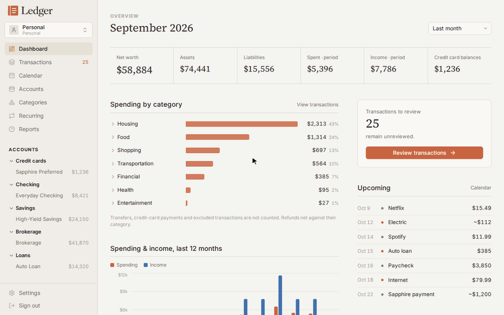
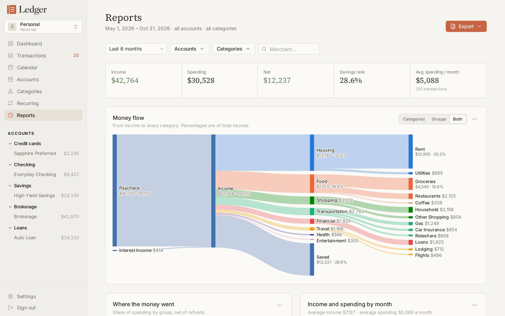
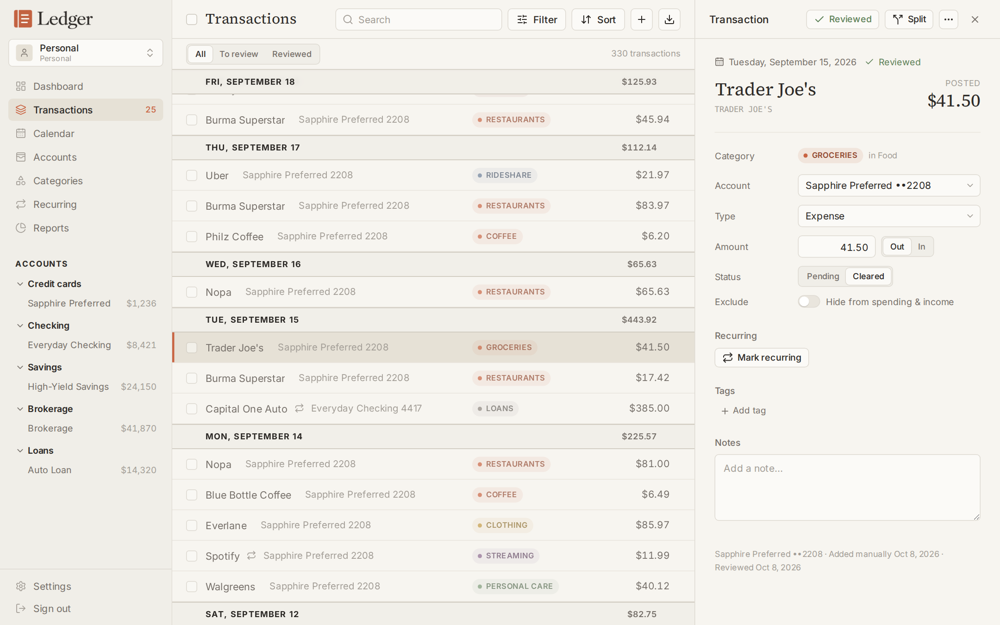
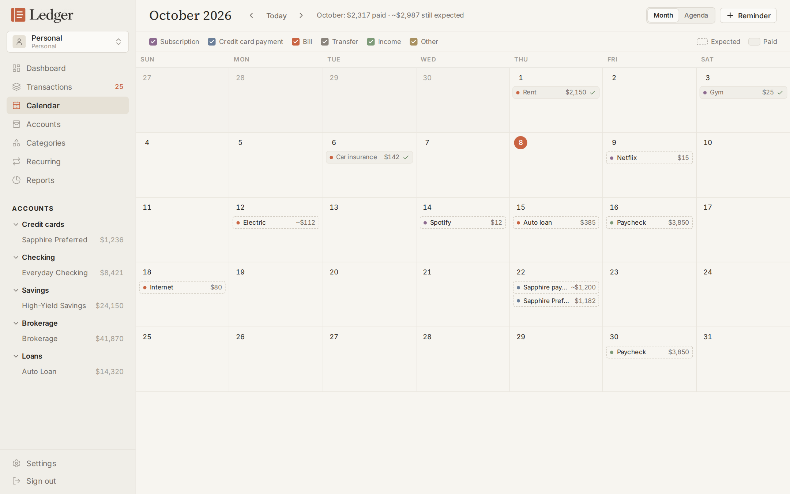
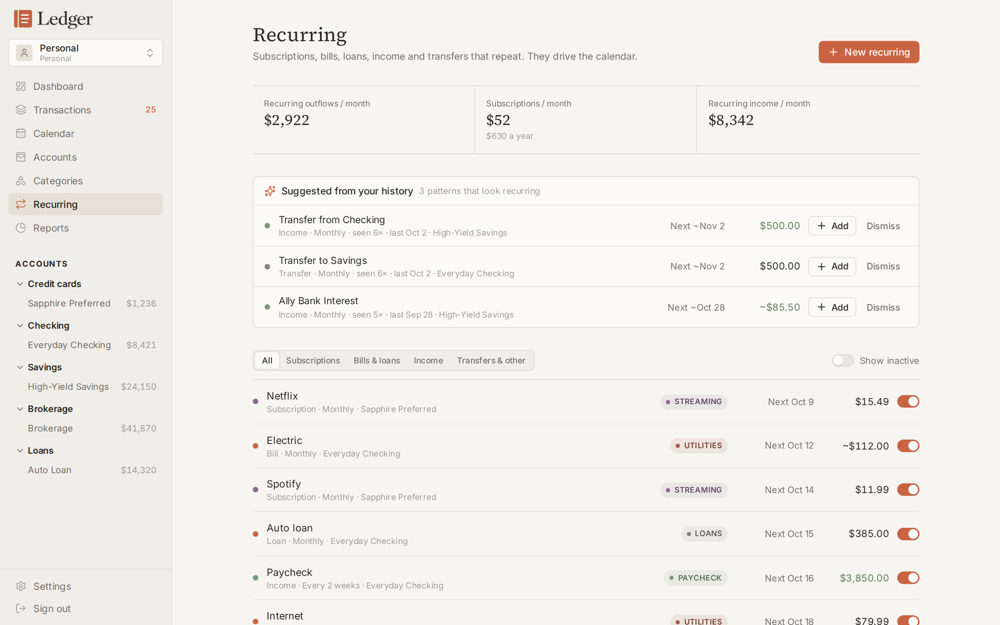

# Ledger Finance

A self-hosted personal and small-business finance app. Connect your banks, review and categorize every transaction, track bills and cards on a calendar, and see where the money goes, in workspaces you can share with a partner or bookkeeper.

Built with Next.js 16, React 19, TypeScript, Tailwind CSS 4 and Supabase (Postgres, Auth, row-level security). Bank data comes from [Plaid](https://plaid.com); crypto balances from Coinbase.



<table>
  <tr>
    <td></td>
    <td></td>
  </tr>
  <tr>
    <td></td>
    <td></td>
  </tr>
</table>

<sub>Screenshots use made-up demo data.</sub>

## Features

- **Transaction review.** A fast ledger with a review queue, keyboard shortcuts, bulk edits (category, tags, reviewed, exclude), split transactions, transfers and full-text search.
- **Bank sync.** Plaid transactions, balances and card statements (balance, minimum, due and close dates). Pending charges update in place; overlapping CSV history is matched, not duplicated.
- **Categories and rules.** Nested categories, auto-categorization rules, and Plaid's categories mapped onto yours.
- **Recurring and calendar.** Bills, subscriptions and income detected and linked automatically, projected on a calendar alongside card due dates and reminders.
- **Reports.** A money-flow Sankey, spending pie, monthly trends, category and merchant rankings, all filterable, and exportable as PNG, CSV or a printable PDF.
- **Workspaces.** Separate personal and business books. Business workspaces get a Schedule C-style chart of accounts and profit-and-loss figures. Invite members as owner, editor or viewer. One bank account can be mirrored into several workspaces.
- **CSV import.** Exports from Copilot, your bank or a spreadsheet: column mapping, sign detection, duplicate detection, and undo.
- **Coinbase.** Read-only API key for crypto balances and activity.

## Quick start

You need Node.js 22+, a free [Supabase](https://supabase.com) project, and optionally a [Plaid](https://dashboard.plaid.com) account.

1. **Create the database.** In your Supabase project, open the SQL Editor and run [`supabase/migrations/20261008000000_schema.sql`](supabase/migrations/20261008000000_schema.sql). Or, with the Supabase CLI linked to your project, run `supabase db push`.
2. **Configure the app.**
   ```bash
   cp .env.example .env.local
   ```
   Fill in `NEXT_PUBLIC_SUPABASE_URL` and `NEXT_PUBLIC_SUPABASE_PUBLISHABLE_KEY` (Supabase → Project Settings → API). The rest is optional; see [Configuration](#configuration).
3. **Run it.**
   ```bash
   npm install
   npm run dev        # http://localhost:3000
   ```
4. **Create your login** at `/login`. Your personal workspace is created on first sign-in.
5. **Lock it down.** In Supabase → Authentication → Sign In / Providers, turn off *Allow new users to sign up* (invite other people from *Settings → Workspace* instead), and turn on *Leaked password protection*.

To try it without real accounts, set `PLAID_ENV=sandbox` and connect Plaid's test bank (username `user_good`, password `pass_good`).

## Configuration

All settings are environment variables (see [`.env.example`](.env.example)).

| Variable | Required | Purpose |
| --- | --- | --- |
| `NEXT_PUBLIC_SUPABASE_URL` | yes | Your Supabase project URL |
| `NEXT_PUBLIC_SUPABASE_PUBLISHABLE_KEY` | yes | Supabase publishable (anon) key |
| `PLAID_CLIENT_ID`, `PLAID_SECRET` | for bank sync | From the Plaid dashboard |
| `PLAID_ENV` | for bank sync | `sandbox` or `production` |
| `PLAID_TOKEN_KEY` | for bank sync | Encrypts Plaid tokens and Coinbase keys at rest. `openssl rand -base64 32`. Don't change it later; existing connections would need reconnecting. |
| `SUPABASE_SERVICE_ROLE_KEY` | for background sync | Lets webhooks and the daily job sync without a signed-in user. Server-only. |
| `CRON_SECRET` | for background sync | Bearer token for `/api/cron/plaid-sync`. `openssl rand -hex 32` |
| `APP_URL` | self-hosting | Public URL, used to give Plaid a webhook address |

Without the background-sync settings, the app syncs when you open it (if the last sync is over 4 hours old) or when you press **Sync**.

### Plaid

Each person running Ledger Finance needs their own Plaid account. Start in **Sandbox**, then request **Production** access to connect real banks. For card statements, enable the **Liabilities** product in the Plaid dashboard. Plaid bills per connected item and product; check their pricing.

## Deploying

**Vercel.** Import the repository, add the environment variables, and deploy. `vercel.json` schedules the daily sync. If Deployment Protection is on, enable *Protection Bypass for Automation* so Plaid's webhooks can reach `/api/plaid/webhook`; the app appends the bypass token automatically.

**Docker / self-hosted.** The Docker setup runs the app plus a small sidecar for the daily sync:
```bash
cp .env.example .env    # fill it in
docker compose up -d --build
```
The app listens on port 3000. Put it behind your reverse proxy, or keep it private on a VPN such as Tailscale. If Plaid can't reach the app, sync still happens on open, on **Sync** and daily. To get instant updates, expose `/api/plaid/webhook` publicly and set `APP_URL`.

## How it works

**Data access.** The browser talks to Supabase directly with the publishable key and the user's session. Every finance row belongs to a workspace, and row-level security limits it to that workspace's members: owners and editors can write, viewers can read. The client chooses the open workspace with an `x-workspace-id` header. Cross-table references use composite `(workspace_id, id)` keys, so a row can never point at another workspace's account or category. Bank connections belong to the user who made them.

**Server code** handles only what the browser can't: Plaid and Coinbase calls, webhook verification and background sync. Plaid access tokens and Coinbase keys are AES-256-GCM encrypted and never sent to the browser. The service-role key is used only for webhooks and the daily job.

**Money.** Amounts are `numeric(14,2)`, signed from the account holder's view: negative is money out. Client arithmetic uses integer cents. Liability balances are stored as a positive amount owed.

**What counts as spending.** Totals come from the `countable_entries` view. It leaves out transfers, card payments, adjustments, excluded rows and transfer or equity categories; refunds net against their category; and split transactions count per split. Business profit and loss uses `pnl_entries`.

**Calendar.** Recurring items are projected from their schedules rather than stored. A real transaction linked to an item replaces its projection, so nothing shows twice.

## Development

| Command | What it does |
| --- | --- |
| `npm run dev` | Development server |
| `npm run build` / `npm start` | Production build / serve |
| `npm run lint` | ESLint |
| `npm run typecheck` | TypeScript |
| `npm test` | Unit tests |

The Plaid and Coinbase sync integration tests run against a real database when `LEDGER_TEST_SUPABASE_URL`, `LEDGER_TEST_EMAIL` and `LEDGER_TEST_PASSWORD` are set. Run them one file at a time, since they share a test user.

After a schema change, add a new migration under `supabase/migrations/` and regenerate the types:
```bash
PSQL="psql <connection-string>" python3 scripts/gen-db-types.py > src/lib/database.types.ts
```
(or `supabase gen types typescript`). Keep the hand-written helpers at the bottom of that file.

```
src/
  app/            Routes (App Router); (app)/ is the signed-in shell, api/ the server routes
  components/     UI by feature, plus ui/ (design system)
  lib/            Queries, domain logic (money, dates, calendar, reports, CSV), server code
supabase/         Database schema and migrations
```

## Contributing

Issues and pull requests are welcome. See [CONTRIBUTING.md](CONTRIBUTING.md). To report a security problem, see [SECURITY.md](SECURITY.md).

## License

[MIT](LICENSE)
